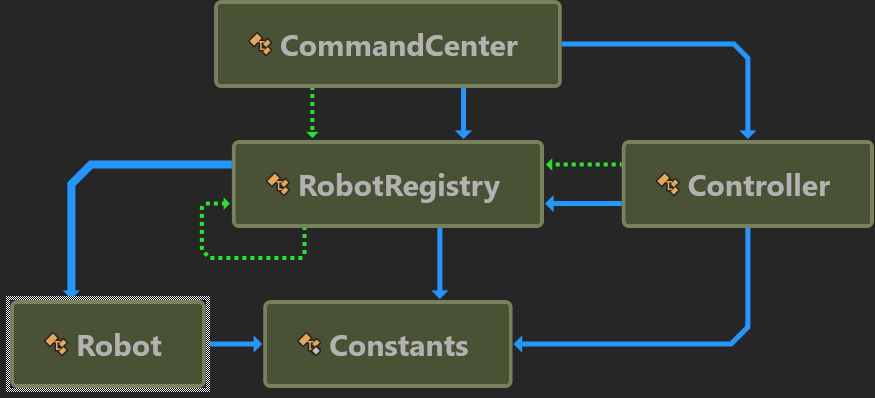

# Model 
I developed the application in **C#** and tried my best to follow the **object-oriented programming** principles.

A simplified model of the classes I've created and the relationships between them can be seen in the following figure.



# Algorithm Description 
I've designed a singleton called _RobotRegistry_. Analogous to a database, this singleton manages a dictionary that maps each robot's **serial number (ID)** to the respective **Robot object**. All the operations involving robots are conducted by referencing this Registry solely based on the ID of a robot. Furthermore, each **Controller** is assigned a consecutive sequence of robot serial numbers. The sequences assigned to the Controllers are disjoint. During each round, the workload is executed by the robots first, followed by the controllers.

# Runnable Simulation 
The executable that should be run is located in the _[ShorelineTask/bin/Debug/net8.0](ShorelineTask/bin/Debug/net8.0)_ folder alongside the corresponding DLLs 
```
Round #1. -1217 generated..
Round #2. -982 generated..
Round #3. -864 generated..
Round #4. -651 generated..
Round #5. -468 generated..
Round #6. -172 generated..
Round #7. -47 generated..
Round #8. 56 generated..
Round #9. 294 generated..
Round #10. 463 generated..
Round #11. 581 generated..
Round #12. 1136 generated..
Round #13. 1012 generated..
Round #14. 1170 generated..
Round #15. 1411 generated..
Round #16. 1359 generated..
Round #17. 1680 generated..
Round #18. 1629 generated..
Round #19. 1625 generated..
Round #20. 1771 generated..
Round #21. 1961 generated..
Round #22. 2408 generated..
Round #23. 2681 generated..
Round #24. 2647 generated..
Round #25. 2679 generated..
Round #26. 3024 generated..
Round #27. 3196 generated..
Round #28. 3389 generated..
Round #29. 3340 generated..
Round #30. 3191 generated..
Round #31. 3303 generated..
Round #32. 2988 generated..
Round #33. 2822 generated..
Round #34. 2262 generated..
Round #35. 2532 generated..
...
Round #55. -607 generated..
Round #56. -904 generated..
Round #57. -1011 generated..
Round #58. -1212 generated..
Round #59. -1416 generated..
Round #60. -1490 generated..
Total number of points obtained: 63439
```
